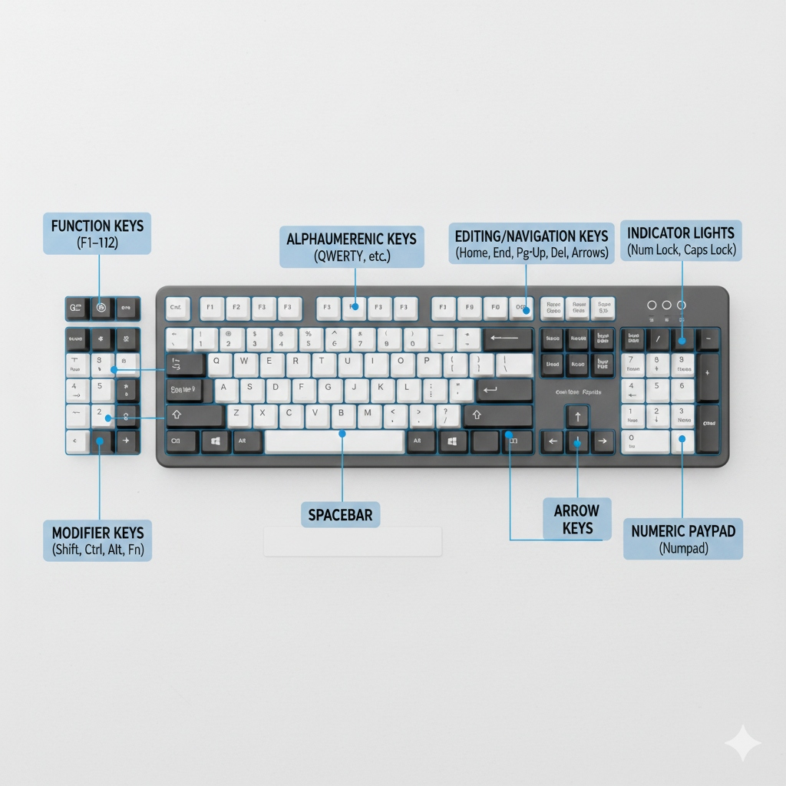
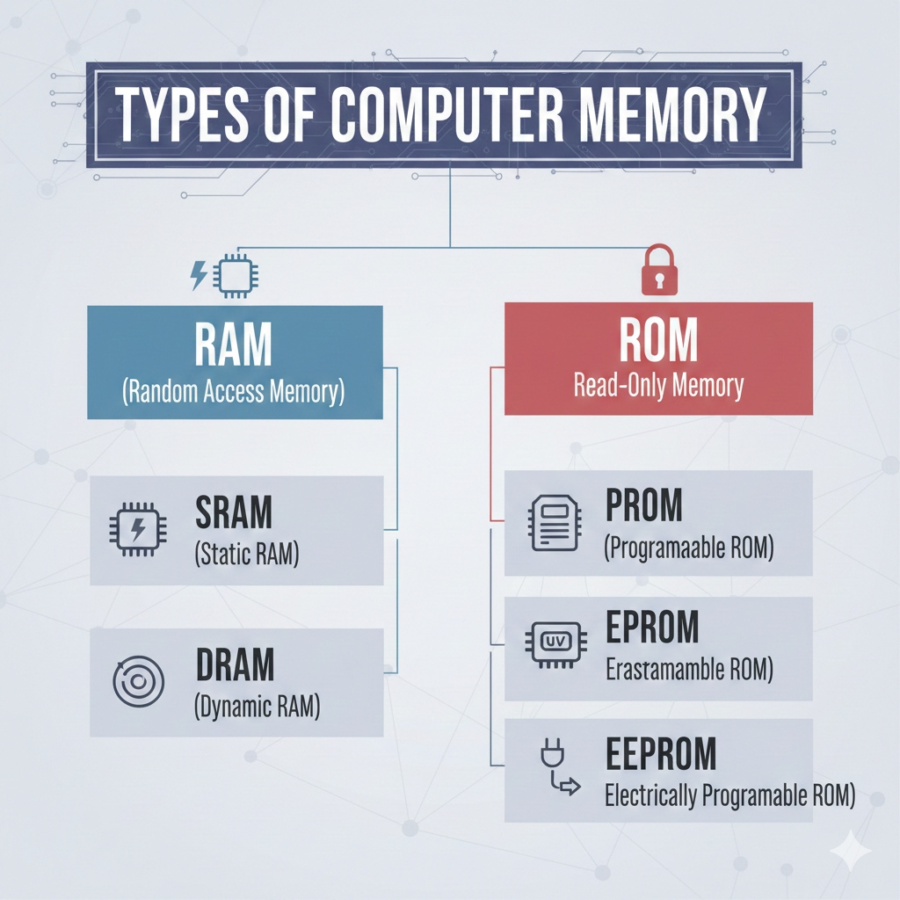

# Computer Hardware

## What is Computer Hardware?

Computer hardware refers to the physical components of a computer system that you can touch and see. It includes the internal components inside the computer case (like the motherboard, RAM, and CPU) as well as external devices (peripherals) such as the monitor, keyboard, and mouse. Hardware works together with software to perform tasks.

---

## What is CPU?

The **CPU (Central Processing Unit)**, often called the "brain" of the computer, is the primary component that performs most of the processing inside a computer. It executes instructions comprising a computer program by performing basic arithmetic, logic, controlling, and input/output (I/O) operations.

### Functionality of CPU

The CPU processes data received from input devices and produces results for output devices. It consists of three main parts:

- **ALU (Arithmetic Logic Unit):** Performs mathematical and logical operations.
- **CU (Control Unit):** Directs the flow of data and instructions.
- **Memory Unit (Registers):** Small, fast storage for temporary data needed during processing.

## Input Devices

### Keyboard

The keyboard is the primary text input device.
_(Image: Diagram of keyboard parts highlighting Function keys, Alphanumeric keys, Arrow keys, and Numeric Keypad)_

#### Typing Finger Chart

For fast typing, each finger is assigned specific keys to minimize movement and increase speed.
_(Image: Color-coded chart showing finger placement on the keyboard)_

<!-- Placeholder for Finger Chart Image -->

### Mouse

The mouse is a pointing device used to interact with the graphical user interface (GUI).
_(Image: Diagram of a mouse showing Left Button, Right Button, Scroll Wheel, and Body)_

<!-- Placeholder for Mouse Parts Image -->

---

## What is Computer Memory?

Computer memory is a physical device capable of storing information temporarily or permanently. It is essential for the computer to start up, run applications, and process data.

### 1. Types of Computer Memory

#### RAM (Random Access Memory)

RAM is volatile memory used for storing data that the CPU is currently using. It loses its data when power is turned off.

- **SRAM (Static RAM):** Faster, more expensive, used for cache.
- **DRAM (Dynamic RAM):** Slower, cheaper, used for main system memory.

#### ROM (Read-Only Memory)

ROM is non-volatile memory containing permanent instructions (firmware) for booting the computer.

- **PROM (Programmable ROM):** Can be programmed once by the user.
- **EPROM (Erasable Programmable ROM):** Can be erased (using UV light) and reprogrammed.
- **EEPROM (Electrically Erasable Programmable ROM):** Can be erased and reprogrammed electrically (e.g., Flash memory).

### RAM vs ROM

| Feature           | RAM (Random Access Memory)       | ROM (Read-Only Memory)              |
| :---------------- | :------------------------------- | :---------------------------------- |
| **Volatile**      | Yes (Data lost when power off)   | No (Data retained without power)    |
| **Restorability** | Data can be read and written     | Data is read-only (mostly)          |
| **Speed**         | Faster                           | Slower                              |
| **Use**           | Storing active data and programs | Storing startup instructions (BIOS) |
| **Types**         | DRAM, SRAM                       | PROM, EPROM, EEPROM                 |

---

### What is Cache Memory?

Cache memory is an extremely fast type of memory that acts as a buffer between the RAM and the CPU. It holds frequently requested data and instructions so that they are immediately available to the CPU when needed, significantly speeding up processing capability.

---

## Storage Devices

### SSD vs HDD

| Feature        | SSD (Solid State Drive)              | HDD (Hard Disk Drive)                 |
| :------------- | :----------------------------------- | :------------------------------------ |
| **Mechanism**  | Flash memory chips (No moving parts) | Spinning magnetic platters            |
| **Speed**      | Very fast (Boot & load times)        | Slower                                |
| **Durability** | More durable (Shock resistant)       | Fragile (Moving parts can break)      |
| **Noise**      | Silent                               | Can produce noise (spinning/clicking) |
| **Cost**       | More expensive per GB                | Cheaper per GB                        |

### Memory vs Storage

| Feature               | Memory (RAM)                         | Storage (HDD/SSD)                     |
| :-------------------- | :----------------------------------- | :------------------------------------ |
| **Retention**         | Volatile (Temporary)                 | Non-volatile (Permanent)              |
| **Speed**             | Extremely fast                       | Slower than RAM                       |
| **Purpose**           | Workspace for CPU                    | Long-term data retention              |
| **Capacity**          | Typically smaller (e.g., 8GB - 64GB) | Typically larger (e.g., 256GB - 10TB) |
| **Direct CPU Access** | Yes                                  | No (Must be loaded into RAM first)    |
