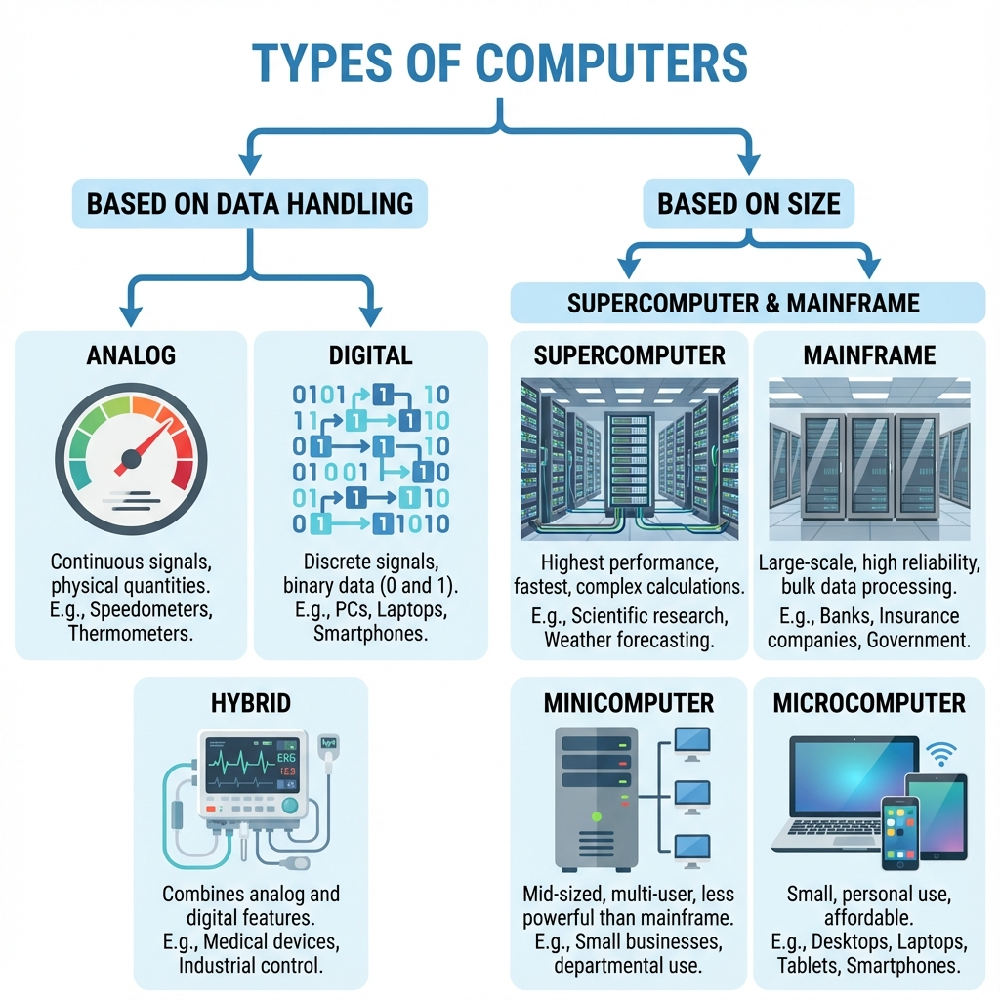
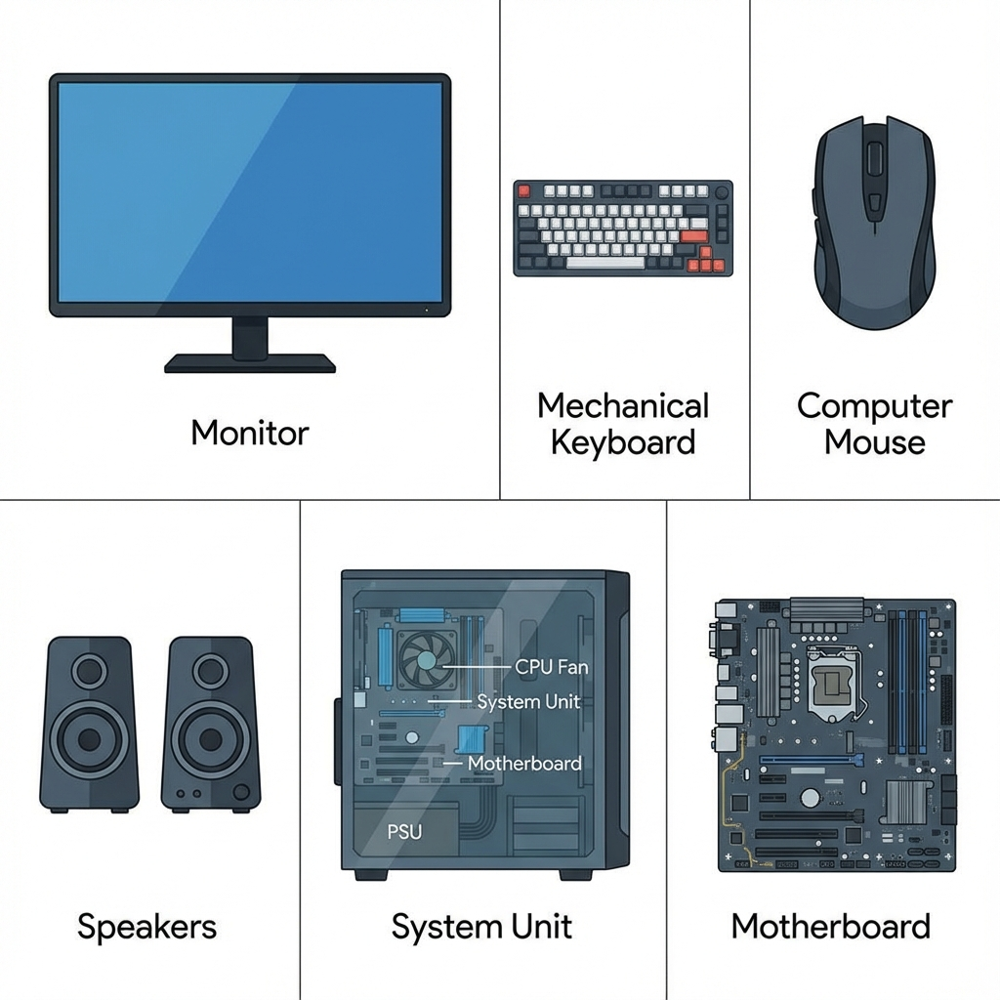

# Computer Fundamentals

Welcome to the **Computer Fundamentals** repository. This project is a collection of notes and resources dedicated to understanding the history, evolution, and basic concepts of computing.

## 📂 Content Overview

### [1-1.1 Computer Fundamentals](1-1%20Computer-Fundamentals.txt)

This document provides a concise history of the evolution of computers, covering key milestones from ancient manual counting tools to the dawn of the electromechanical age.

**Key Topics Covered:**

- **From Manual Counting to Mechanical Calculation:** The origins of computing with the Abacus (3000 BC) and Napier’s Bones (1617).
- **The Era of Mechanical Inventors:** The development of mechanical calculators like the Pascaline (1642) and the Leibniz Wheel (1685).
- **The Rise of Programmability and Data:** The introduction of punched cards with the Jacquard Loom (1804), Charles Babbage's Analytical Engine (1833), and Hollerith's Census Machine (1889).
- **The Electromechanical Age:** The transition to automatic calculation with the Harvard Mark I (1944).

### [1-1.2 Generations of Computers](1-2%20Generations-of-Computers.txt)

Following the history of early computing devices, the evolution of modern computers is categorized into five generations.

**The Five Generations:**

1. **First Generation (1940-1956):** Vacuum Tubes.
2. **Second Generation (1956-1963):** Transistors.
3. **Third Generation (1964-1971):** Integrated Circuits.
4. **Fourth Generation (1971-Present):** Microprocessors.
5. **Fifth Generation (Present & Beyond):** Artificial Intelligence.

### [1-1.3 Types of Computers](1-3%20Types-of-Computers.txt)

Computers are classified based on their data handling capabilities and distinct size/performance characteristics.

**1. Based on Data Handling:**

- **Analog:** For continuous physical data (e.g., Speedometer).
- **Digital:** For discrete binary data (e.g., Laptops).
- **Hybrid:** Combines both analog and digital features (e.g., ECG Machine).

**2. Based on Size & Capacity:**

- **Supercomputers:** Fastest, for complex research.
- **Mainframes:** Large scale, for organizations.
- **Minicomputers:** Mid-range multi-user systems.
- **Microcomputers:** Personal devices (PCs, Smartphones).

### [1-1.4 Components of Computers](1-4%20Components-of-Computers.txt)

A computer system is composed of physical components (Hardware) that interact to perform tasks.

**Key Hardware Components:**

- **Input:** Keyboard, Mouse.
- **Output:** Monitor, Speaker.
- **System Unit:**
  - **Motherboard:** The main circuit board connecting all parts.
  - **CPU:** The processing brain.
  - **PSU (Power Supply Unit):** Provides power to the system.

## 🚀 Getting Started

Simply open the text files to read the notes. As this repository grows, more topics related to computer fundamentals will be added.

## 🤝 Contribution

Feel free to suggest improvements or add more historical facts and fundamental concepts!
